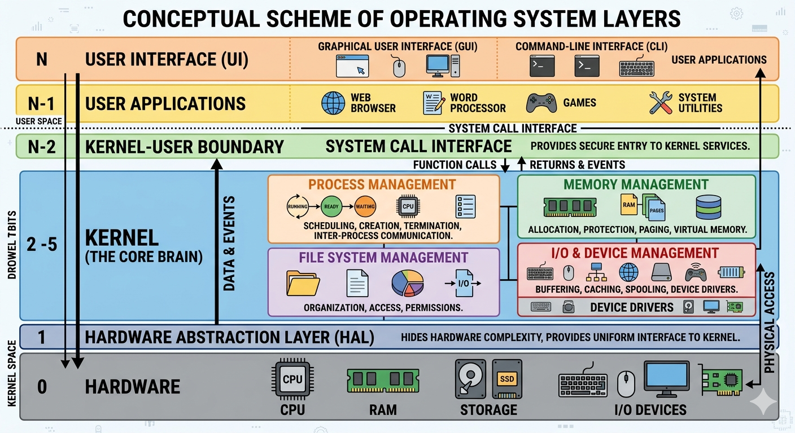

# 🧠 Поглиблений теоретичний курс: Принципи роботи сучасних ОС

## 1. Архітектура та рівнева структура ОС

Операційна система (ОС) — це не монолітна програма, а складна багатошарова структура. Головний принцип її побудови — **абстракція**. ОС приховує від прикладних програм складні деталі роботи заліза (електричні сигнали, таймінги, адреси регістрів) і надає простий уніфікований інтерфейс.

### 🏗️ Рівнева модель комп'ютерної системи:
1.  **Користувач (User):** Взаємодіє з графічним (GUI) або командним (CLI) інтерфейсом.
2.  **Прикладне ПЗ (Applications):** Браузери, офісні пакети, ігри. Вони не мають прямого доступу до заліза.
3.  **Прикладний програмний інтерфейс (API / Системні виклики):** Набір функцій, за допомогою яких програми просять ОС щось зробити (наприклад, відкрити файл).
4.  **Підсистеми ОС та Драйвери:** Керують логікою (файлові системи, мережеві протоколи) та перекладають команди мовою конкретного заліза.
5.  **Ядро ОС (Kernel):** Серце системи, що працює в захищеному режимі процесора.
6.  **Апаратне забезпечення (Hardware):** Процесор (CPU), оперативна пам'ять (RAM), диски (SSD/HDD), материнська плата.

---

## 2. Керування процесором та планування завдань

Сучасні процесори мають обмежену кількість ядер (наприклад, 4, 6 або 8), але одночасно в системі працюють тисячі потоків. ОС створює ілюзію одночасності за допомогою **мультипрограмування** та **динамічного планування**.

### ⏱️ Механізм переривань (Interrupts)
Ядро ОС не контролює процесор кожну секунду. Процесор виконує код програми, поки не відбудеться **переривання**:
*   **Апаратне переривання:** Сигнал від заліза (ви натиснули клавішу, мишка поворухнулася, мережева карта отримала пакет даних). Процесор миттєво зупиняє поточну програму і передає керування ядру ОС.
*   **Програмне переривання (Системний виклик):** Коли програмі потрібно зберегти файл, вона сама викликає переривання, віддаючи контроль ОС.

### 📊 Алгоритми планувальника CPU
Планувальник ОС вирішує, який процес отримає право виконатися на процесорі наступним. Основні алгоритми:

1.  **FIFO (First-In, First-Out):** Хто перший прийшов, того першого і обслуговують. Мінус: довгий процес може заблокувати короткі, що йдуть за ним (ефект конвою).
2.  **Round Robin (Карусель):** Кожному процесу виділяється маленький квант часу (наприклад, 10–20 мілісекунд). Якщо процес не встиг, він відправляється в кінець черги, а процесор перемикається на наступний. Саме цей алгоритм забезпечує плавність інтерфейсу.
3.  **Пріоритетне планування (Priority Scheduling):** Процеси з вищим пріоритетом (наприклад, системні звуки або драйвер миші) обробляються першими.

---

## 3. Процеси, Потоки та Проблема Deadlocks

Як ми вже знаємо, **процес** — це ізольована програма в пам'яті, а **потік** — нитка виконання всередині процесу. Оскільки процеси та потоки часто ділять спільні ресурси (файли, пристрої, змінні), виникає небезпека "зависання".

### 🔒 Взаємне блокування (Deadlock)
**Deadlock (смертельні обійми)** — це ситуація, коли два або більше процесів не можуть продовжувати роботу, бо кожен чекає на ресурс, який зайнятий іншим.

> **Аналогія з реального життя:** Уявіть вузький міст, на якому з'їхалися лоб в лоб два автомобілі. Жоден не може проїхати вперед, і жоден не хоче здавати назад. Вони заблоковані назавжди.

| Процес 1 | Процес 2 | Результат |
| :--- | :--- | :--- |
| Захопив Ресурс А | Захопив Ресурс Б | Обидва утримують свої ресурси. |
| Намагається отримати Ресурс Б (чекає) | Намагається отримати Ресурс А (чекає) | **Система зависла (Deadlock)** |

ОС борються з цим за допомогою алгоритмів виявлення дедлоків (наприклад, алгоритм банкіра Дейкстри) або просто примусово завершують один із процесів.

---

## 4. Еволюція та керування оперативною пам'яттю

Коли ви запускаєте програму, ОС має виділити їй місце в RAM. Раніше пам'ять виділялася суцільними шматками, що призводило до серйозної проблеми.

### 🧩 Фрагментація пам'яті
Коли програми постійно запускаються і закриваються, в оперативній пам'яті утворюються "дірки" — вільні шматки невеликого розміру. Може виникнути ситуація, коли сумарно вільної пам'яті багато (наприклад, 2 ГБ), але вона розкидана шматочками по 50 МБ. Якщо ви спробуєте запустити гру, якій потрібно 500 МБ суцільної пам'яті, вона не запуститься.

### 📄 Сторінкова організація (Paging)
Сучасні ОС вирішили цю проблему. Пам'ять ділиться на однакові маленькі блоки — **сторінки** (зазвичай по 4 КБ). 
*   **Віртуальна пам'ять:** Програмі здається, що вона працює з безперервним великим масивом пам'яті.
*   **Таблиця сторінок:** ОС сама розкидає ці сторінки по різних вільних куточках фізичної RAM. Для програми це непомітно. Якщо фізичної RAM не вистачає, ОС скидає "зайві" сторінки на жорсткий диск у **файл підкачки (Swap/Paging file)**.

---

## 5. Анатомія Файлових Систем (FS)

Файлова система — це структура, яка визначає, як дані записуються на фізичні сектори диска. Без неї диск був би просто гігантським потоком нулів та одиниць.

### 💾 Порівняння популярних файлових систем:
*   **FAT32:** Стара система. Працює всюди (Windows, macOS, Linux, магнітоли). Мінус: не підтримує файли розміром більше ніж 4 ГБ.
*   **NTFS:** Стандарт для Windows. Підтримує величезні файли, шифрування та права доступу.
*   **ext4:** Стандарт для Linux та Android. Надзвичайно швидка та стійка до збоїв.

### 📝 Що таке журналювання?
Сучасні системи (NTFS, ext4) є **журнальованими**. Перед тим як записати файл на диск, ОС робить швидку замітку у спеціальний файл-журнал: *"Я збираюся записати файл Х в папку Y"*. 
Якщо в цей момент вимкнеться світло, після перезавантаження ОС зазирне в журнал, побачить незавершену дію і миттєво відновить структуру диска без втрати інших даних і тривалої перевірки (chkdsk).

---

## 6. Безпека та розмежування прав доступу

ОС захищає користувачів та саму себе від шкідливих програм через рівні привілеїв.

### 👑 Режими роботи процесора:
1.  **Режим ядра (Kernel Mode):** Максимальні права. Код має доступ до будь-якої точки пам'яті та заліза. Тут працює ядро ОС. Якщо тут стається помилка — система падає в "синій екран" (BSOD) або паніку ядра (Kernel Panic).
2.  **Режим користувача (User Mode):** Обмежені права. Тут працюють усі ваші програми (ігри, браузери). Якщо Chrome зависне, він не зможе зламати всю ОС, бо його пам'ять ізольована.

### 🔐 Права доступу до файлів (POSIX / Windows ACL)
В ОС Linux/macOS кожен файл має чітку матрицю прав для трьох категорій: **Власник (User)**, **Група (Group)**, **Усі інші (Others)**.
Права діляться на три типи:
*   `r` (read) — читання.
*   `w` (write) — запис/редагування.
*   `x` (execute) — виконання (запуск програми чи скрипту).
